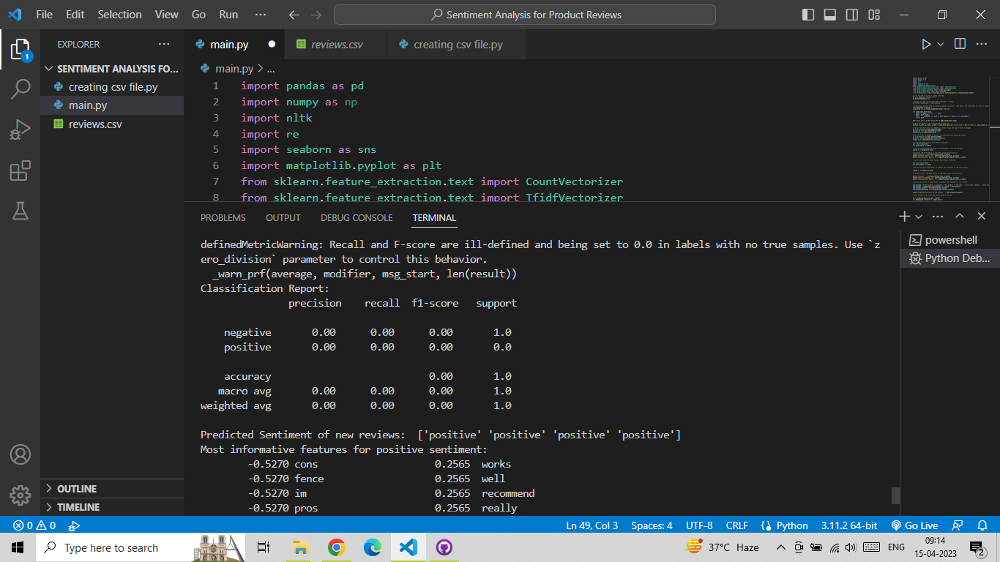
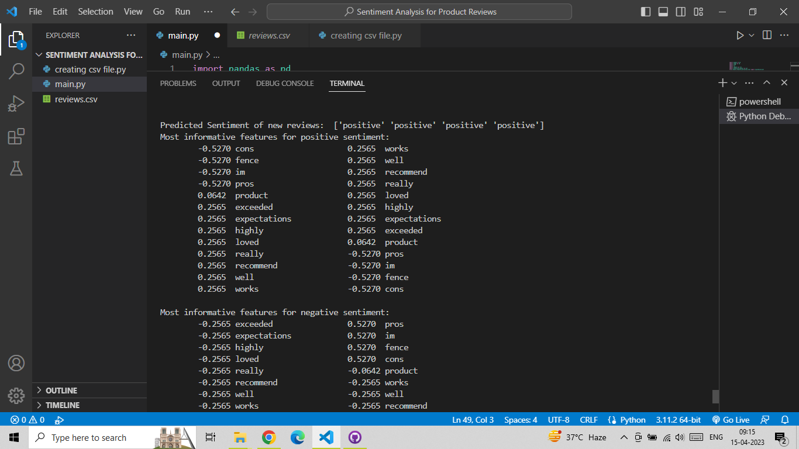
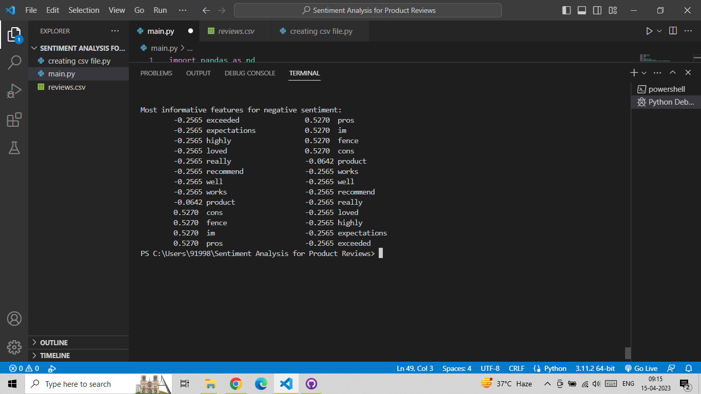
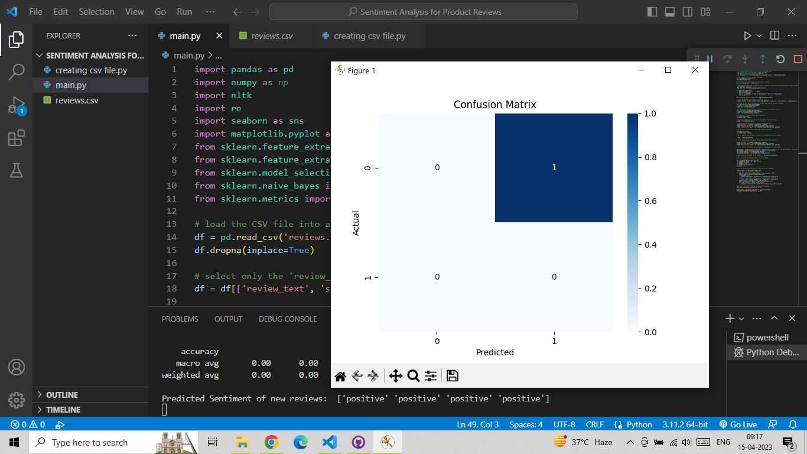

# Sentiment-Analysis-for-Product-Reviews
This project aims to utilize Natural Language Processing (NLP) techniques, particularly the NLTK library, to analyze the sentiment of product reviews.
The ability to automatically determine the sentiment of a product review is valuable for businesses as it allows them to quickly identify the overall sentiment towards their products and make informed decisions about how to improve them. Additionally, it can also benefit consumers by providing them with an objective evaluation of a product before they make a purchase.

Our project is built on Python and utilizes various NLP techniques, including tokenization, stopword removal, and sentiment analysis.

By leveraging these techniques, we aim to create a robust and accurate sentiment analysis tool that can be applied to a wide range of product reviews. We hope that this project will be useful for businesses looking to improve their products and for consumers looking to make informed purchasing decisions.

# Table of Contents
## Screenshot
## Installation
## Contributing

# Screenshot
there is the some screensot 

# Installation 
You can install this project directiory using this command
1. Clone the repository - git clone https://github.com/umairrrkhan/Sentiment-Analysis-for-Product-Reviews.git

# Contributing
Contributions to this project are always welcome! Here are a few ways you can help:
1. Report any bugs or issues you encounter while using the project.
2. Suggest new features or improvements.
3. Submit a pull request with bug fixes, improvements, or new features.

